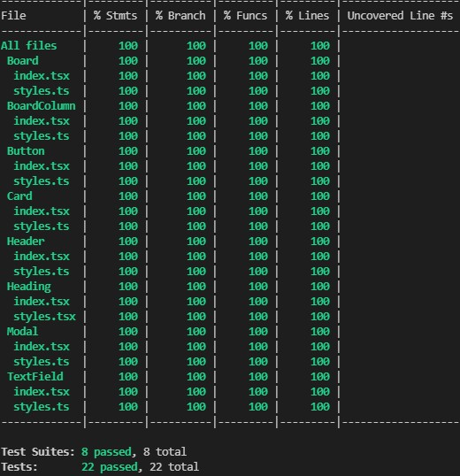

# KANBAN BOARD

A Kanban board made using Reactjs, Typescript and Styled Components.

### [Demo](https://kanban-board-marcus.vercel.app/)

<br/>


<br/>

## What is inside?

This project uses lot of stuff as:

<a href="https://pt-br.reactjs.org/" ></a>
<a href="https://www.typescriptlang.org/" ></a>
<a href="https://styled-components.com/" ></a>
<a href="https://testing-library.com/docs/react-testing-library/intro" ></a>
<a href="https://storybook.js.org/" ></a>

<br/>

## Getting Started

First, clone this repo

```bash
git clone git@github.com:mvmmarcus/avatar-upload.git
```

Then, install all project dependencies

```bash
yarn install
# or
npm install
```

Run the development server:

```bash
yarn start
# or
npm start
```

Open [http://localhost:3000](http://localhost:3000) with your browser to see the result.

<br/>

## Test the components in the storybook

Run the command below to view all components variations

```
yarn storybook
```

Open [http://localhost:6006](http://localhost:6006) with your browser to see components

### [Storybook](https://avatar-cropper-mv.vercel.app/)

<br />


<br/>

## All components are coveraged by tests

Run the command below to execute all tests

```
yarn test
```



<br/>

## Commit messages protected by git hooks

This project uses Husky's library to lint code and run tests

<br/>

## Commands

- `start`: runs your application on `localhost:3000`
- `build`: creates the production build version
- `start`: starts a simple server with the build production code
- `lint`: runs the linter in all components and pages
- `test`: runs jest to test all components and pages
- `test:watch`: runs jest in watch mode
- `storybook`: runs storybook on `localhost:6006`
- `build-storybook`: create the build version of storybook

## 👨‍💻 Developer

<table id="contribuicoes" >
  <tr>
    <td align="center"><a href="https://www.linkedin.com/in/mvmmarcus/"><br /><sub><b>Marcus Vinícius</b></sub></a><br /><a href="https://gitlab.com/mvmmarcus" title="Marcus Vinicius"></a></td>
  </tr>
</table>

Developed with ❤️ by <a href="https://www.linkedin.com/in/mvmmarcus/">Marcus Vinícius</a>
